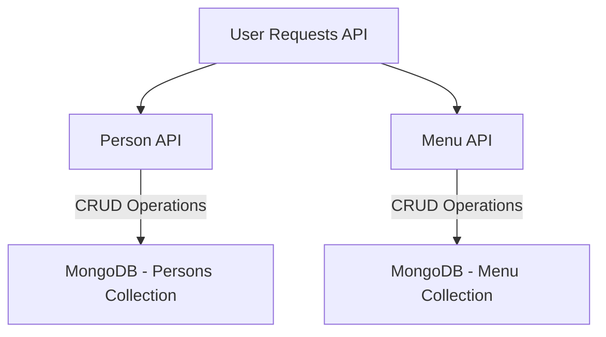

# Hotel Management Backend Application

## Overview
The Hotel Management application is a Node.js-based system developed using the Express.js framework, with MongoDB as the chosen database. This application manages information related to persons (staff) and menu items. It exposes specific endpoints to handle CRUD (Create, Read, Update, Delete) operations for both persons and menu items.

---

## Features
- **Person Management:** Add, retrieve, update, and delete staff details.
- **Menu Management:** Add, retrieve, update, and delete menu items.
- **Role-Based Person Retrieval:** Fetch persons by their work type (chef, waiter, manager, etc.).
- **Taste-Based Menu Retrieval:** Fetch menu items based on their taste category (sweet, spicy, sour, etc.).
- **Secure and Scalable:** Built using Node.js, Express.js, and MongoDB for efficiency and scalability.

---

## API Endpoints

### **Persons**
- **Add a Person**
  - **Endpoint:** `POST /person`
  - **Description:** Adds a person to the system with details such as name, role, etc.
- **Get All Persons**
  - **Endpoint:** `GET /person`
  - **Description:** Retrieves a list of all persons in the system.
- **Get Persons by Work Type**
  - **Endpoint:** `GET /person/:workType`
  - **Description:** Retrieves a list of persons based on their work type (e.g., chef, waiter, manager).
- **Update a Person**
  - **Endpoint:** `PUT /person/:id`
  - **Description:** Updates the details of a specific person identified by their ID.
- **Delete a Person**
  - **Endpoint:** `DELETE /person/:id`
  - **Description:** Deletes a person from the system based on their ID.

### **Menu Items**
- **Add a Menu Item**
  - **Endpoint:** `POST /menu`
  - **Description:** Adds a menu item to the system with details such as name, price, taste, etc.
- **Get All Menu Items**
  - **Endpoint:** `GET /menu`
  - **Description:** Retrieves a list of all menu items in the system.
- **Get Menu Items by Taste**
  - **Endpoint:** `GET /menu/:taste`
  - **Description:** Retrieves a list of menu items based on their taste (e.g., sweet, spicy, sour).
- **Update a Menu Item**
  - **Endpoint:** `PUT /menu/:id`
  - **Description:** Updates the details of a specific menu item identified by its ID.
- **Delete a Menu Item**
  - **Endpoint:** `DELETE /menu/:id`
  - **Description:** Deletes a menu item from the system based on its ID.

---

## Data Models

### **Person Model**
The Person data model represents information about staff members in the hotel.

#### **Fields:**
- `name`: String (Person's name)
- `age`: Number (Person's age)
- `work`: Enum (Role in the hotel, such as chef, waiter, manager)
- `mobile`: String (Person's mobile number)
- `email`: String (Person's email address, unique)
- `address`: String (Person's address)
- `salary`: Number (Person's salary)

#### **Example:**
```json
{
  "name": "John Doe",
  "age": 30,
  "work": "waiter",
  "mobile": "123-456-7890",
  "email": "john@example.com",
  "address": "123 Main Street",
  "salary": 30000
}
```

### **Menu Item Model**
The MenuItem data model represents information about menu items available in the hotel.

#### **Fields:**
- `name`: String (Item's name)
- `price`: Number (Item's price)
- `taste`: Enum (Item's taste, such as sweet, spicy, sour)
- `is_drink`: Boolean (Indicates if the item is a drink, default is false)
- `ingredients`: Array of Strings (List of ingredients, default is an empty array)
- `num_sales`: Number (Number of sales for the item, default is 0)

#### **Example:**
```json
{
  "name": "Chocolate Cake",
  "price": 12.99,
  "taste": "sweet",
  "is_drink": false,
  "ingredients": [ "chocolate", "flour", "sugar" ],
  "num_sales": 50
}
```

---

## System Workflow


---

## Installation & Setup

### **1. Clone the Repository**
```sh
git clone https://github.com/your-repo/hotel-management-backend.git
cd hotel-management-backend
```

### **2. Install Dependencies**
```sh
npm install
```

### **3. Set Up Environment Variables**
Rename `.env.example` to `.env` and configure your environment variables:
```sh
MONGODB_URI=your_mongodb_connection_string
PORT=5000
```

### **4. Start the Server**
```sh
npm start
```
Server will run at `http://localhost:5000`

---

## Technologies Used
- **Backend:** Node.js, Express.js
- **Database:** MongoDB
- **Authentication:** JWT, bcrypt (if authentication is added later)

---

## License
This project is open-source and available under the [MIT License](LICENSE).

